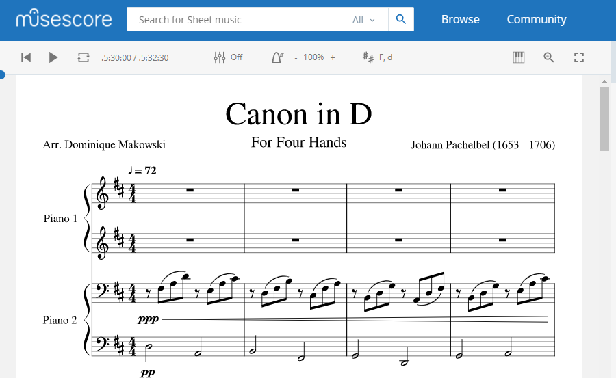
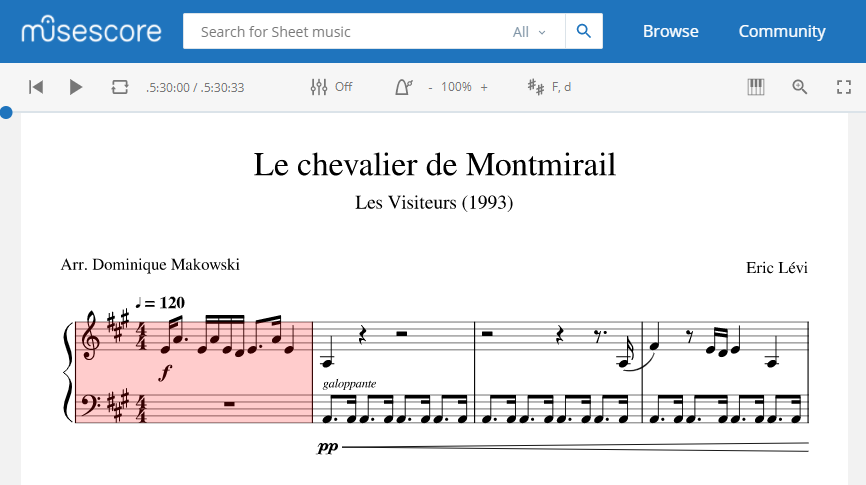

# Music

My arrangements and compositions.

- See my [**musescore profile**](https://musescore.com/dominiquemakowski).

## Tabs

- See my [**tabs collection**](https://dominiquemakowski.github.io/Music/tabs)

## Piano

### Greensleeves

*"Greensleeves"* is a traditional English folk song found in several late-16th-century and early-17th-century sources.

- [**Listen on YouTube**](https://www.youtube.com/watch?v=c1goTidB1Es)
- [**View and Download the score on Musescore**](https://musescore.com/dominiquemakowski/greensleeves)

### Canon in D for Four Hands (Pachelbel)

The "Canon in D" is a famous piece by the German Baroque composer Johann Pachelbel (1653 - 1706).

- [**Listen on Musescore**](https://musescore.com/dominiquemakowski/canon-in-d)
- [**View and Download the score on Musescore**](https://musescore.com/dominiquemakowski/canon-in-d)

### Le Chevalier de Montmirail \& Enae Volare (Les Visiteurs)

Piano arrangement for a theme from the French movie "Les Visiteurs" (1993) that is featured in several epic scenes.

- [**Listen on Musescore**](https://musescore.com/dominiquemakowski/les-visiteurs)
- [**View and Download the score on Musescore**](Piano/LesVisiteurs/LesVisiteurs_DominiqueMakowski.pdf)

### Work In Progress

#### The Throne Room (Star Wars)

- [**View and Download the score on Musescore**](Piano/TheThroneRoom/TheThroneRoom_DominiqueMakowski.pdf)

#### The Lighting Of The Beacons (Lord of the Rings)

- [**View and Download the score on Musescore**](Piano/LightingOfTheBeacons/LightingOfTheBeacons_DominiqueMakowski.pdf)

#### Enae Volare (Era)

- To do
